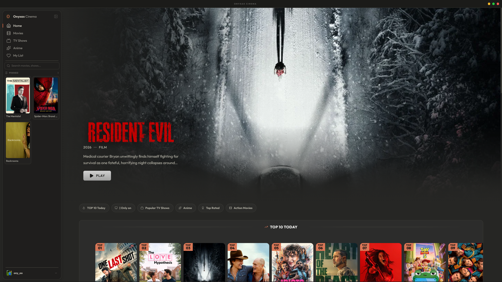

# Onyxax Cinema

<p align="center">
  
</p>

<p align="center">
  <strong>A cinematic desktop experience for movies, TV series & anime — in one elegant app.</strong><br>
  <em>Built with Electron • React • TypeScript • TMDB • Supabase</em>
</p>

<p align="center">
  
</p>

<p align="center">
  <a href="https://github.com/onyxax/onyxax-cinema/releases" style="display:inline-block; padding:9px 18px; margin:4px; background:#111827; color:#fff; border-radius:8px; text-decoration:none; font-weight:600; font-size:13px; border:1px solid #1f2937;">Releases</a>
  <a href="https://github.com/onyxax/onyxax-cinema/issues" style="display:inline-block; padding:9px 18px; margin:4px; background:#111827; color:#fff; border-radius:8px; text-decoration:none; font-weight:600; font-size:13px; border:1px solid #1f2937;">Issues</a>
  <a href="#download" style="display:inline-block; padding:9px 18px; margin:4px; background:#d97757; color:#fff; border-radius:8px; text-decoration:none; font-weight:700; font-size:13px; border:1px solid #d97757;">Download</a>
  <a href="#getting-started" style="display:inline-block; padding:9px 18px; margin:4px; background:#fff; color:#111827; border-radius:8px; text-decoration:none; font-weight:600; font-size:13px; border:1px solid #e5e7eb;">For Developers</a>
</p>

---

##  Quick Navigation

|  **For Everyone** |  **For Developers** |
| :--- | :--- |
| [Download](#download) — Get the app in 3 clicks | [Getting Started](#getting-started) — Run the code locally |
| [Features](#features) — What you can watch & do | [Project Structure](#project-structure) — How the code is organized |
| [Overview](#overview) — What is Onyxax Cinema? | [Tech Stack](#tech-stack) — What it's built with |

---

<a id="overview"></a>
##  Overview

**Onyxax Cinema** aggregates **movies**, **TV series**, and **anime** into a single, beautifully crafted desktop interface.

> Rich **TMDB** metadata • **Multi-server** playback • Persisted **watch progress** • **Discord Rich Presence**

- **Safety-first** — adult content is filtered by **keywords + TMDB adult flags + AniList verification** before it ever reaches your library.
- **Protected player** — stream URLs are resolved **only in the Electron main process** and delivered to the renderer **AES-256-CBC encrypted**.
- **Polished UX** — cinematic hero, Quick Preview on hover, grid / premium list views, and a collapsible dock.

---

<a id="features"></a>
##  Features

|  | Feature | Details |
| :---: | :--- | :--- |
|  | **Catalog** | Movies, TV series & anime with posters, ratings, trailers & recommendations via **TMDB API** |
|  | **Multi-Server Playback** | Multiple providers, **autoplay next episode**, resume from last position |
|  | **Safety Filtering** | Keyword blocklist + `adult` flags + **AniList** adult verification for anime |
|  | **Localization** | **10 languages** — `ar` `en` `fr` `es` `de` `it` `pt` `ru` `zh` `ja` • Auto `RTL` for Arabic & `Tajawal` font |
|  | **Accounts & Profiles** | Email/password auth via **Supabase**, avatar upload via **Cloudinary**, personal library |
|  | **Discord Rich Presence** | Live title, `S01E05 • 57% • 19m left`, poster as `large_image`, app logo as permanent `small_image` |
|  | **Automatic Updates** | Checks **GitHub Releases** on startup, downloads & installs **silently or manually** |
|  | **Protected Player** | URLs generated in `main.ts`, never exposed in renderer source |
|  | **Designed for Windows** | **NSIS** installer, silent-update support — *Windows 10/11* |

---

<a id="download"></a>
##  Download

<p align="center">
  <a href="https://github.com/onyxax/onyxax-cinema/releases/latest"></a>
</p>

**3 steps to watch:**

| Step | What to do | |
| :---: | :--- | :---: |
| **1** | Click the big **Download for Windows** button above |  |
| **2** | Open the downloaded `OnyxaxCinemaSetup1.2.9.exe` and click **Next → Install** |  |
| **3** | Open **Onyxax Cinema** from Desktop/Start and start watching |  |

- **System:** Windows 10 / 11 (64-bit) — no extra setup.
- **Updates:** The app checks on startup and can update silently — you don't need to do anything.
- **No account needed** to browse; create one only if you want a personal list.

<details>
<summary><strong>Having trouble downloading?</strong> Click to see help</summary>

- If Windows SmartScreen says “Unknown publisher” → Click **More info → Run anyway** (normal for new apps).
- If antivirus blocks it → It's a false positive from the fresh installer — allow it or download from **Releases** page directly.
- Still stuck? Open an [Issue](https://github.com/onyxax/onyxax-cinema/issues) and write in any language — we’ll help.

</details>

---

<a id="tech-stack"></a>
##  Tech Stack

| Layer | Technology |
| :--- | :--- |
|  Desktop Shell | **Electron 41** |
|  UI | **React 19** + **TypeScript** + **Vite 8** |
|  Styling | **Tailwind CSS 4** + CSS variables |
|  Data | **TMDB API** • **Supabase** (auth) • **Cloudinary** (media) |
|  State | **React Context + Hooks** |
|  i18n | **i18next** • 10 locales • RTL handling |
|  Integrations | **Discord RPC** • **PeerJS** |

<p align="center">
  
</p>

---

<a id="getting-started"></a>
##  Getting Started

###  For Developers & Contributors

####  Prerequisites

- **Node.js** `22+`
- **npm** `10+`

####  Installation

```bash
npm install
```

###  Environment Variables

Copy the template and fill in your values:

```bash
cp .env.example .env
```

| Variable | Description | Required |
| :--- | :--- | :---: |
| `VITE_SUPABASE_URL` | Supabase project URL | Yes |
| `VITE_SUPABASE_ANON_KEY` | Supabase anon (public) key | Yes |
| `VITE_SUPABASE_PUBLISHABLE_KEY` | Supabase publishable key | — |
| `VITE_TMDB_API_KEY` | TMDB API key (`themoviedb.org/settings/api`) | Yes |
| `VITE_CLOUDINARY_CLOUD_NAME` | Cloudinary cloud name | Yes |
| `VITE_CLOUDINARY_API_KEY` | Cloudinary API key | — |
| `VITE_DISCORD_CLIENT_ID` | Discord Application ID for Rich Presence | — |
| `VITE_UPDATE_GITHUB_REPO` | `owner/repo` hosting release builds (updater) | — |

###  Development

```bash
npm run dev          # Renderer in browser (vite)
npm run electron:dev # Full Electron app in dev mode
```

###  Production Build

```bash
npm run typecheck    # TypeScript checks (renderer + Electron main)
npm run lint         # ESLint
npm run build        # Production bundle → dist/ + dist-electron/
npm run dist         # Build + package NSIS installer → release/<version>/
```

The installer is written to `release/<version>/OnyxaxCinemaSetup<version>.exe`.

---

<a id="project-structure"></a>
##  Project Structure

```
├── electron/            # Electron main & preload processes
│   ├── main.ts          # Window, IPC, Discord RPC, updater, encrypted stream URLs
│   └── preload.ts       # contextBridge API + frame protection
├── src/
│   ├── components/      # UI — Dock, Hero, MovieCard, Player, QuickPreview, ...
│   ├── context/         # AuthContext (Supabase session + RPC toggle)
│   ├── hooks/           # useDiscordRPC, usePinned, usePreviewData, ...
│   ├── pages/           # Home, Watch, Details, Category, Search, MyList, Auth, Legal
│   ├── services/        # tmdb, supabase, cloudinary
│   ├── types/           # TMDB & app types
│   ├── locales/         # Split translations (10 languages)
│   ├── locales.ts       # Barrel for i18n resources
│   └── i18n.ts          # i18next setup, RTL & font handling
├── public/              # Static assets & icons
├── scripts/             # Icon generation tooling
└── index.html
```

---

##  Security

- **No secrets in git** — `.env` is ignored, only `.env.example` is tracked.
- **Encrypted stream URLs** — resolver runs **exclusively in main process**; renderer receives only `iv:ciphertext`.
- **Hardened window** — `devTools: false` in packaged builds, `contextMenus` & `F12/Ctrl+Shift+I` blocked in `electron/main.ts` + `preload.ts`.
- **Frame protection** — `X-Frame-Options/CSP` stripped + `Access-Control-Allow-Origin: *` for player iframes only.

---

##  Releases & Updates

1. Bump `version` in `package.json`
2. Run `npm run dist` to produce the NSIS installer
3. Upload `release/<version>/OnyxaxCinemaSetup<version>.exe` to a **GitHub Release** named `OnyxaxCinemaSetup<version>`
4. Ensure `VITE_UPDATE_GITHUB_REPO` points to `owner/repo` so the in-app updater (`CHECK_FOR_UPDATES` in `main.ts`) can find the release

The updater checks on startup (`App.tsx` → `CHECK_FOR_UPDATES`) and supports **silent** (`/S`) or **manual** install.

---

##  License

**MIT** — see [LICENSE](LICENSE).

<p align="center">
  Made with precision by <strong>Onyxax</strong> — Cinema, elevated.
</p>
